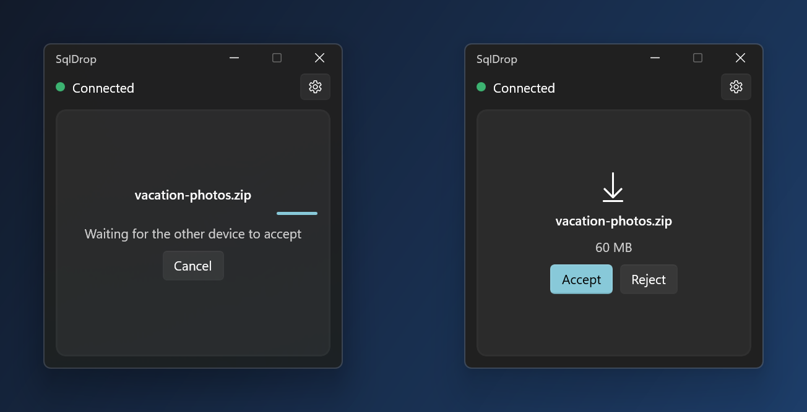
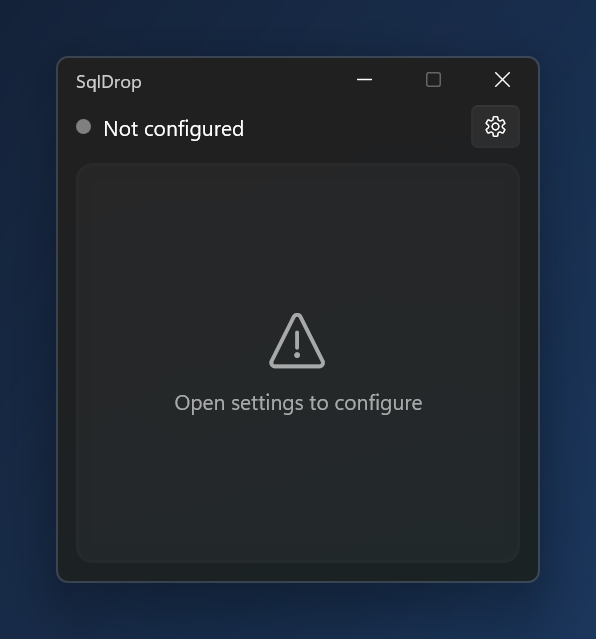
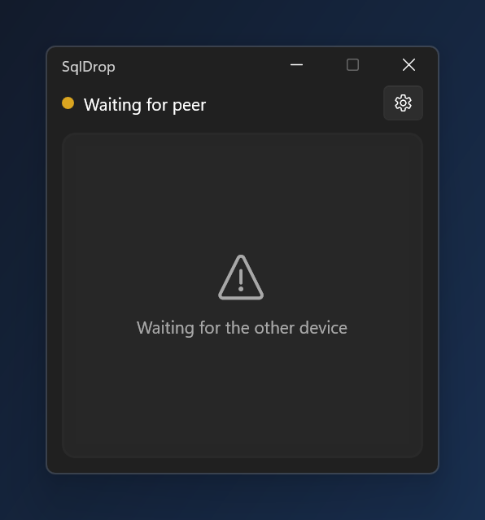
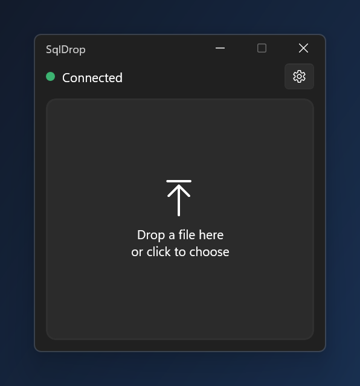
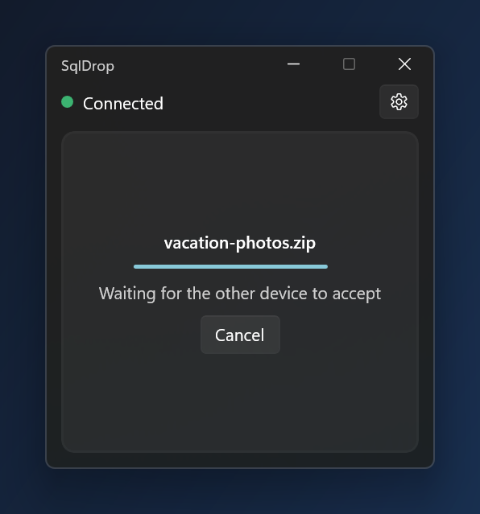
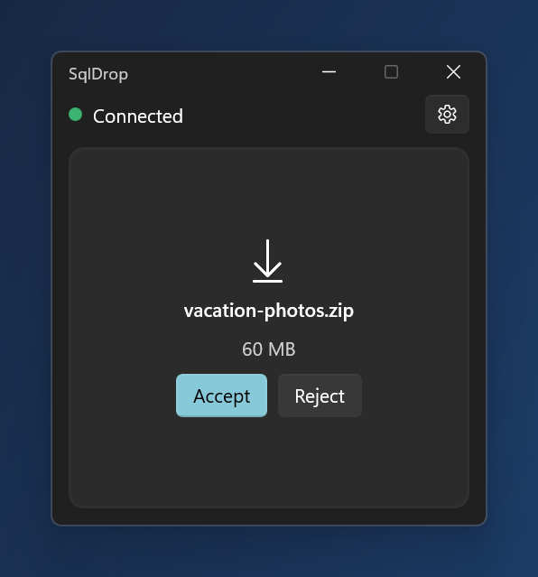
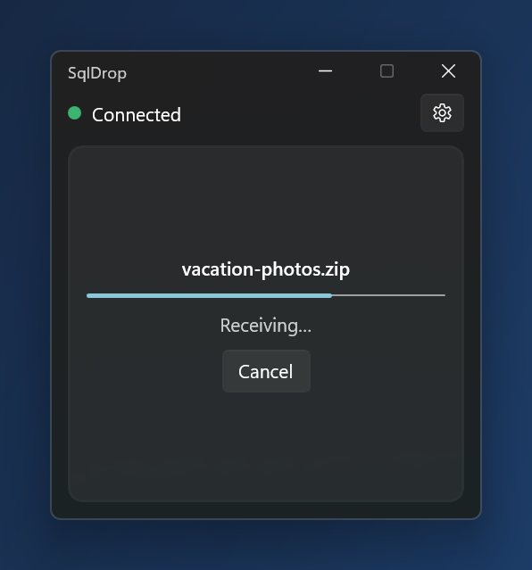
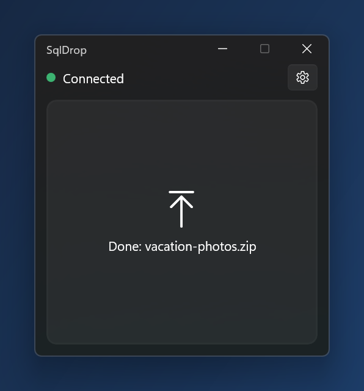
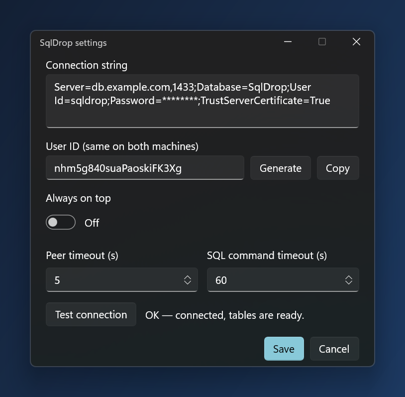

# SqlDrop

A tiny portable Windows utility for moving a file between two of your machines through a **shared MS SQL Server database**. No ports to open, no cloud account, no installer: if both machines can reach the same SQL Server, they can exchange files.

Drop a file on one machine, press **Accept** on the other, pick a folder. The file travels encrypted, and nothing is left in the database afterwards.

<p align="center">
  
</p>

## Features

- Small, fixed-size WinUI 3 window with drag-and-drop (or click to choose a file)
- Live connection status: *Not configured / No DB connection / Waiting for peer / Connected / Channel busy*
- Both machines are paired by one shared **User ID** (random, generated in the app)
- Files are encrypted end to end with **AES-256-GCM**; the key is derived from the User ID and never stored in the DB
- Either side can send; one file at a time; accept / reject on the receiving side; cancel from either side
- Presence via a 1-second heartbeat in the DB; a peer is considered gone after 5 seconds of silence (configurable)
- Everything is removed from the DB after a successful transfer; abandoned transfers expire after 24 hours
- **Portable:** config and window position live next to the exe; the app itself uses no registry, `%APPDATA%` or `%TEMP%` (only Windows' own file pickers remember recently used folders)

## Screenshots

The main states of the window (Windows 11, dark theme; the window follows the system light/dark setting).

<table>
  <tr>
    <td align="center" width="33%"><br><b>Not configured</b><br>First start: open the gear and enter the connection string and User ID.</td>
    <td align="center" width="33%"><br><b>Waiting for peer</b><br>Connected to the DB, the other device isn't online yet.</td>
    <td align="center" width="33%"><br><b>Connected</b><br>Both devices see each other. Drop a file or click to choose one.</td>
  </tr>
  <tr>
    <td align="center"><br><b>Sending</b><br>File uploaded; waiting for the other device to accept.</td>
    <td align="center"><br><b>Incoming file</b><br>The other device offers a file: Accept (and choose a folder) or Reject.</td>
    <td align="center"><br><b>Receiving</b><br>Chunks are downloaded and decrypted; either side can cancel.</td>
  </tr>
  <tr>
    <td align="center"><br><b>Done</b><br>The file is saved and the transfer is removed from the database.</td>
    <td align="center" colspan="2"><br><b>Settings</b><br>Connection string, User ID (generate / copy), always-on-top, peer and SQL command timeouts, and a connection test that also creates the tables. (Values shown are placeholders.)</td>
  </tr>
</table>

## How it works

```
 Machine A                      SQL Server                       Machine B
 ─────────                      ──────────                       ─────────
 heartbeat  ───── UPDATE LastSeen ──▶ SqlDrop_Peers ◀── UPDATE LastSeen ───── heartbeat
 (1 s)                                                                         (1 s)

 drop file
  │ encrypt 1 MB chunks
  └──────── INSERT chunks ───▶ SqlDrop_TransferChunks
            status Ready   ───▶ SqlDrop_Transfers ──── poll (1 s) ───▶ "Incoming file" card
                                                                         │ Accept + choose folder
            chunks  ◀──────────────────────────────────────────────────  │ download + decrypt
 "Done"  ◀─── row deleted ◀───────────────────────────────────────────── delete transfer
```

Transfer statuses: `Uploading → Ready → Downloading → (row deleted)`, or `Rejected / Cancelled / Failed`. Every status change is a conditional `UPDATE ... WHERE Status = <expected>`, so concurrent actions (e.g. Accept vs. Cancel) can't both win.

More detail is in [docs/REQUIREMENTS.md](docs/REQUIREMENTS.md).

## Requirements

**To run** (on each machine):

- Windows 10 1809 (build 17763) or newer, x64
- [.NET 8 Desktop Runtime](https://dotnet.microsoft.com/download/dotnet/8.0) (x64)
- [Windows App SDK 1.8 runtime](https://learn.microsoft.com/windows/apps/windows-app-sdk/downloads) (x64)
- Network access to a SQL Server both machines can reach, and a database on it

The app is *framework-dependent*, not self-contained, so the runtimes above must already be installed. If they are missing the app won't start.

**To build / test:**

- .NET 8 SDK (a newer SDK works too)
- Docker Desktop (only for the integration tests)

## Database setup

1. Create an empty database (any name), e.g. `SqlDrop`.
2. Use a SQL login/user with permission to `CREATE TABLE` and `SELECT/INSERT/UPDATE/DELETE` in it.
3. The app creates its tables automatically on first connection (idempotent):
   `SqlDrop_Peers`, `SqlDrop_Transfers`, `SqlDrop_TransferChunks`.

Files up to 100 MB are stored in `varbinary(max)` while in transit, so a database with the **SIMPLE** recovery model avoids transaction-log growth.

Example connection string:

```
Server=myserver,1433;Database=SqlDrop;User Id=sqldrop;Password=...;TrustServerCertificate=True
```

## Build

```bash
dotnet build src/SqlDrop -c Release
```

The output is in `src/SqlDrop/bin/Release/net8.0-windows10.0.19041.0/win-x64/`. That folder is the whole app: zip it, copy it to the other machine, unzip anywhere **writable** (not `Program Files`), and run `SqlDrop.exe`. To remove the app, delete the folder.

## Setup and use

1. Start `SqlDrop.exe` and click the gear icon.
2. Paste the **connection string**.
3. Click **Generate** to create a User ID, then **Copy** and send it to your other machine (e.g. via a messenger). Paste the *same* ID into the settings of the second instance.
4. **Test connection** (also creates the tables), then **Save**.
5. When both windows show a green **Connected**, drop a file on one of them (or click the drop area to choose one).
6. On the other machine press **Accept**, choose a folder, done. **Reject** discards the file; **Cancel** aborts a running transfer from either side.

Settings are saved in `config.json` next to the exe:

| Field | Meaning |
|---|---|
| `ConnectionString` | SQL Server connection string |
| `UserId` | Shared pairing id and encryption secret |
| `AlwaysOnTop` | Keep the window above others |
| `PeerTimeoutSeconds` | How long the other instance may stay silent before it counts as gone (default `5`, allowed 2–300). Raise on an unstable network. |
| `CommandTimeoutSeconds` | Timeout of every SQL command, including each 1 MB chunk upload/download (default `60`, allowed 5–600). Raise on a slow link. |
| `WindowX`, `WindowY` | Last window position |

Both timeouts are also in the settings window (*Peer timeout* and *SQL command timeout*) and take effect as soon as you press Save. The *login* timeout is part of the connection string (`Connect Timeout=30`).

You can run several instances from the same folder; each gets its own identity at start-up.

## Security model

SqlDrop is built for a **trusted environment** and is deliberately simple:

- `ChannelId = SHA-256(userId)` identifies the pair in the DB; the User ID itself is never stored there.
- `Key = SHA-256(userId + "|key")`, used for AES-256-GCM with a random 12-byte nonce per chunk. The same data therefore encrypts differently every time. Each chunk is authenticated, and a wrong key or tampered chunk fails the transfer.
- File name and exact size are encrypted too. Visible in the DB: random instance GUIDs, the hashed channel id, timestamps, status, chunk count and ciphertext size (so the file size is inferable to ~1 MB).
- `config.json` (connection string and User ID) is **plain text** next to the exe.

Not covered: key stretching (use the generated random User ID, not a short typed one), binding chunks to their position (a DB writer could swap two chunks), and attackers who hold both DB access and the User ID.

## Tests

Integration tests run against a real SQL Server in Docker.

```powershell
./tools/start-test-db.ps1      # SQL Server 2022 in Docker, reachable on 127.0.0.1:14333 only (throwaway, public test credentials)
dotnet test
```

The script only needs the `docker` command; it creates the container on the first run, reuses it later, and waits until SQL Server accepts logins (`-Name`, `-Port` and `-Password` are optional; `-Remove` deletes the container). The script also creates an empty `SqlDropTest` database and prints a ready-to-use connection string, so you can paste it into the SqlDrop settings window to try the app locally (the app creates its tables, but not the database). The tests use the same database. To use another server, set the `SQLDROP_TEST_CONN` environment variable to a connection string. Covered: crypto round trips and tampering, peer detection and loss, channel-busy, full transfer with hash comparison, reject, cancel, size limit, corrupted chunk, TTL expiry.

`tools/PeerCli` is a headless dev peer for manually testing the real app against a scripted counterpart: set the `SQLDROP_CONN` environment variable to a connection string (so the password never lands in the command line), then run `PeerCli <userId> send <file>` or `PeerCli <userId> listen`.

## Repository layout

```
src/SqlDrop.Core/     crypto, config store, SQL access (Dapper), session + transfer logic
src/SqlDrop/          WinUI 3 app (code-behind, no MVVM framework)
tests/SqlDrop.Tests/  xUnit tests (crypto + SQL Server integration)
tools/                test DB script, PeerCli
docs/                 requirements
```

Stack: C#, .NET 8, WinUI 3 (Windows App SDK 1.8), Dapper, Microsoft.Data.SqlClient, xUnit.

## Limitations

- One file at a time, no folders, 100 MB limit
- No resume: if the connection drops mid-transfer the transfer fails and you send again
- At most two live instances per User ID; a third sees *Channel busy*
- Windows only; drag-and-drop doesn't work if the app runs elevated while Explorer doesn't
- Speed is bound by the connection to the DB (one chunk per round trip)

## Troubleshooting

| Symptom | Likely cause |
|---|---|
| **No DB connection** (hover the status for the error) | Wrong connection string, server unreachable, missing permissions. On Docker use `127.0.0.1` rather than `localhost`. |
| **Waiting for peer** on both | Different User IDs, different databases, or the other side isn't running or can't reach the DB. On a slow or flaky link also try a larger *Peer timeout* in settings. |
| Transfer fails with a timeout error | Slow link: raise *SQL command timeout* in settings. |
| **Channel busy** | Two other instances already use this User ID. |
| "The app folder is not writable" | Move the folder somewhere you can write (config is stored next to the exe). |
| App doesn't start at all | Missing .NET 8 Desktop Runtime or Windows App SDK 1.8 runtime. |
